# Overfitting Stress Tests

## Baseline Metrics
| Symbol | Run ID | Sharpe | AnnRet | MaxDD | Trades |
| --- | --- | --- | --- | --- | --- |
| GBPUSD | 20251119_235440 | 0.658 | 1.80% | -10.16% | 344 |
| EURUSD | 20251119_235248 | 0.370 | 0.79% | -10.20% | 740 |
| USDCHF | 20251119_235256 | 0.102 | 0.22% | -6.87% | 272 |
| AUDUSD | 20251119_235310 | 1.015 | 2.12% | -10.11% | 806 |
| GBPJPY | 20251119_235322 | -0.810 | -2.67% | -13.53% | 6 |
| USDJPY | 20251119_235333 | 1.161 | 0.63% | -0.84% | 1660 |

## Sliding Window Tests
### AUDUSD — PASS
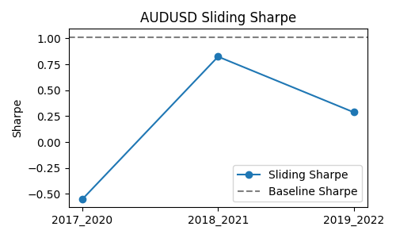
| Window | Run ID | Sharpe | ΔSharpe | AnnRet | ΔAnnRet | MaxDD | ΔMaxDD | Trades | ΔTrades |
| --- | --- | --- | --- | --- | --- | --- | --- | --- | --- |
| 2017_2020 | 20251120_091643 | -0.552 | -1.567 | -1.14% | -3.25% | -10.08% | 0.02% | 526 | -280 |
| 2018_2021 | 20251120_091733 | 0.825 | -0.190 | 1.44% | -0.68% | -10.15% | -0.04% | 594 | -212 |
| 2019_2022 | 20251120_091805 | 0.287 | -0.727 | 0.64% | -1.47% | -7.00% | 3.11% | 554 | -252 |

### GBPJPY — PASS
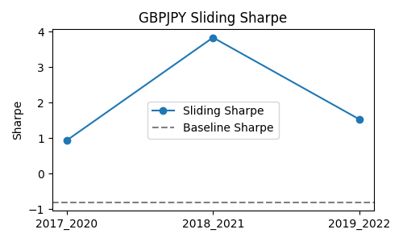
| Window | Run ID | Sharpe | ΔSharpe | AnnRet | ΔAnnRet | MaxDD | ΔMaxDD | Trades | ΔTrades |
| --- | --- | --- | --- | --- | --- | --- | --- | --- | --- |
| 2017_2020 | 20251120_091847 | 0.941 | 1.751 | 9.42% | 12.08% | -10.22% | 3.32% | 34 | +28 |
| 2018_2021 | 20251120_091919 | 3.836 | 4.646 | 82.73% | 85.40% | -12.96% | 0.57% | 216 | +210 |
| 2019_2022 | 20251120_092015 | 1.536 | 2.346 | 14.94% | 17.60% | -12.37% | 1.16% | 30 | +24 |

### USDJPY — FAIL
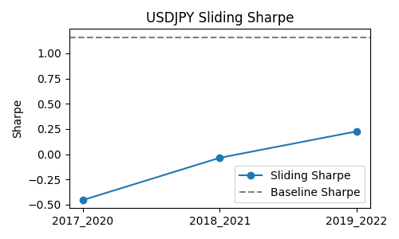
| Window | Run ID | Sharpe | ΔSharpe | AnnRet | ΔAnnRet | MaxDD | ΔMaxDD | Trades | ΔTrades |
| --- | --- | --- | --- | --- | --- | --- | --- | --- | --- |
| 2017_2020 | 20251120_092056 | -0.454 | -1.615 | -0.10% | -0.73% | -0.81% | 0.03% | 1966 | +306 |
| 2018_2021 | 20251120_092148 | -0.036 | -1.197 | -0.01% | -0.64% | -1.06% | -0.22% | 1980 | +320 |
| 2019_2022 | 20251120_092229 | 0.226 | -0.935 | 0.05% | -0.59% | -0.75% | 0.09% | 2068 | +408 |

### GBPUSD — PASS
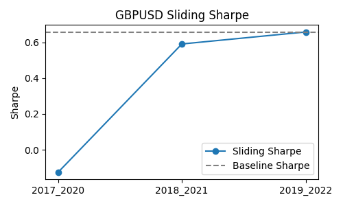
| Window | Run ID | Sharpe | ΔSharpe | AnnRet | ΔAnnRet | MaxDD | ΔMaxDD | Trades | ΔTrades |
| --- | --- | --- | --- | --- | --- | --- | --- | --- | --- |
| 2017_2020 | 20251120_083849 | -0.127 | -0.785 | -0.39% | -2.18% | -9.84% | 0.32% | 778 | +434 |
| 2018_2021 | 20251120_083947 | 0.591 | -0.067 | 1.61% | -0.19% | -10.08% | 0.08% | 622 | +278 |
| 2019_2022 | 20251120_084035 | 0.658 | 0.000 | 1.80% | 0.00% | -10.16% | 0.00% | 344 | +0 |

### EURUSD — PASS
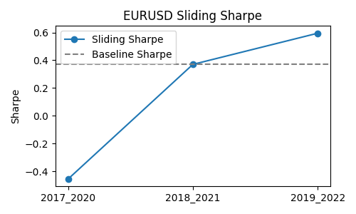
| Window | Run ID | Sharpe | ΔSharpe | AnnRet | ΔAnnRet | MaxDD | ΔMaxDD | Trades | ΔTrades |
| --- | --- | --- | --- | --- | --- | --- | --- | --- | --- |
| 2017_2020 | 20251120_090442 | -0.456 | -0.827 | -0.84% | -1.63% | -10.03% | 0.17% | 568 | -172 |
| 2018_2021 | 20251120_090448 | 0.370 | 0.000 | 0.79% | 0.00% | -10.20% | 0.00% | 740 | +0 |
| 2019_2022 | 20251120_090457 | 0.595 | 0.225 | 1.28% | 0.49% | -3.92% | 6.28% | 650 | -90 |

### USDCHF — FAIL
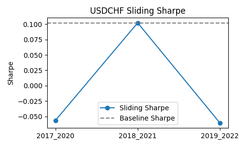
| Window | Run ID | Sharpe | ΔSharpe | AnnRet | ΔAnnRet | MaxDD | ΔMaxDD | Trades | ΔTrades |
| --- | --- | --- | --- | --- | --- | --- | --- | --- | --- |
| 2017_2020 | 20251120_090633 | -0.057 | -0.159 | -0.10% | -0.32% | -4.28% | 2.60% | 710 | +438 |
| 2018_2021 | 20251120_090644 | 0.102 | 0.000 | 0.22% | 0.00% | -6.87% | 0.00% | 272 | +0 |
| 2019_2022 | 20251120_090657 | -0.061 | -0.163 | -0.09% | -0.31% | -6.94% | -0.06% | 166 | -106 |

## Cost Pressure Tests (spread/slip/comm × 1.5)
| Symbol | Status | Run ID | Sharpe | ΔSharpe | AnnRet | ΔAnnRet | MaxDD | ΔMaxDD | Trades | ΔTrades | Chart |
| --- | --- | --- | --- | --- | --- | --- | --- | --- | --- | --- |
| GBPUSD | PASS | 20251120_092717 | 2.416 | 1.758 | 8.69% | 6.89% | -3.33% | 6.83% | 818 | +474 | 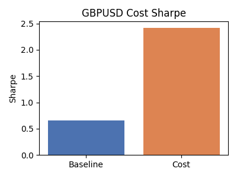 |
| EURUSD | PASS | 20251120_092830 | 1.993 | 1.623 | 6.53% | 5.73% | -4.68% | 5.53% | 1286 | +546 | 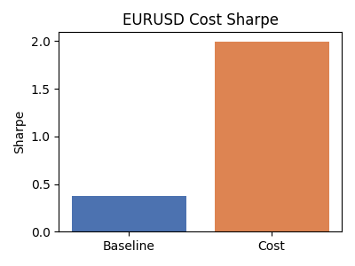 |
| USDCHF | PASS | 20251120_092852 | 2.019 | 1.917 | 4.81% | 4.59% | -1.86% | 5.02% | 364 | +92 | 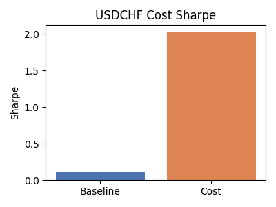 |
| AUDUSD | PASS | 20251120_092921 | 2.408 | 1.393 | 6.97% | 4.86% | -4.13% | 5.98% | 1190 | +384 | 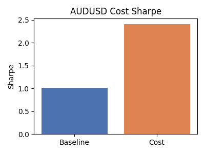 |
| GBPJPY | PASS | 20251120_092946 | 1.185 | 1.995 | 14.21% | 16.87% | -9.99% | 3.54% | 34 | +28 | 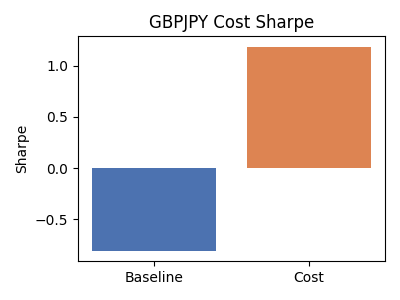 |
| USDJPY | PASS | 20251120_093019 | 2.127 | 0.965 | 0.40% | -0.23% | -0.60% | 0.24% | 986 | -674 | 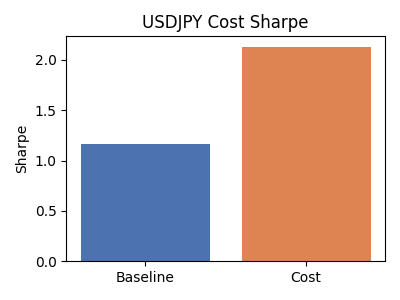 |

## Volatility Warp Tests (σ=0.05)
| Symbol | Status | Run ID | Sharpe | ΔSharpe | Trades | Notes | Chart |
| --- | --- | --- | --- | --- | --- | --- | --- |
| GBPUSD | FAIL | 20251120_093729 | 0.000 | -0.658 | 0 | No trades under warp | 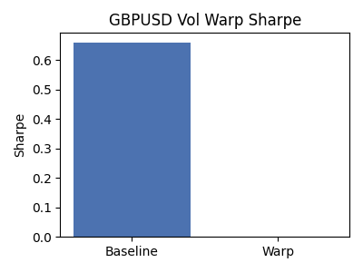 |
| EURUSD | FAIL | 20251120_093842 | 0.000 | -0.370 | 0 | No trades under warp | 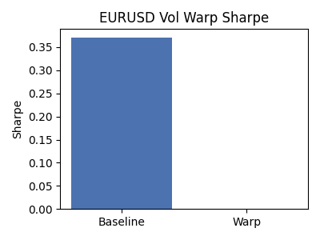 |
| USDCHF | FAIL | 20251120_094004 | 0.000 | -0.102 | 0 | No trades under warp | 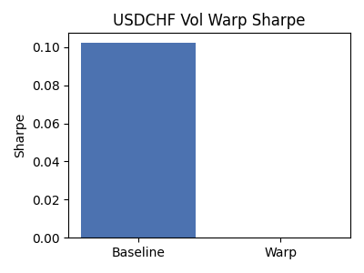 |
| AUDUSD | FAIL | 20251120_094104 | 0.000 | -1.015 | 0 | No trades under warp | 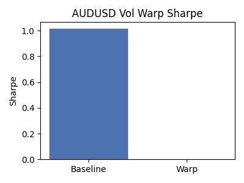 |
| GBPJPY | FAIL | 20251120_094245 | 0.000 | 0.810 | 0 | No trades under warp | 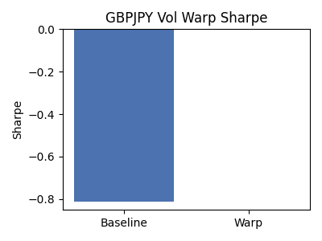 |
| USDJPY | FAIL | 20251120_094352 | 0.000 | -1.161 | 0 | No trades under warp | 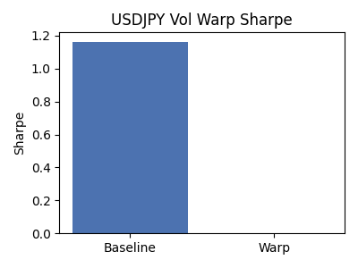 |

## Volatility Spike Tests
| Symbol | Status | Run ID | Sharpe | ΔSharpe | Trades | Notes | Chart |
| --- | --- | --- | --- | --- | --- | --- | --- |
| GBPUSD | PASS | 20251120_141928 | 0.029 | -0.629 | 1504 |  | 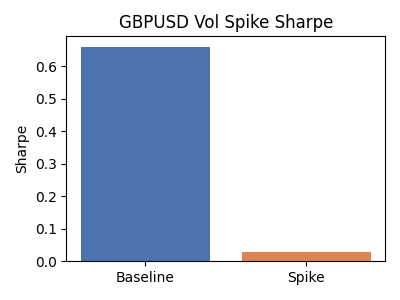 |
| EURUSD | PASS | 20251120_145115 | -0.635 | -1.005 | 424 |  | 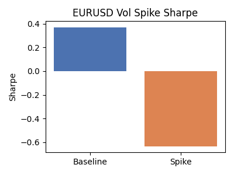 |
| AUDUSD | PASS | 20251120_145345 | -0.275 | -1.290 | 1640 |  | 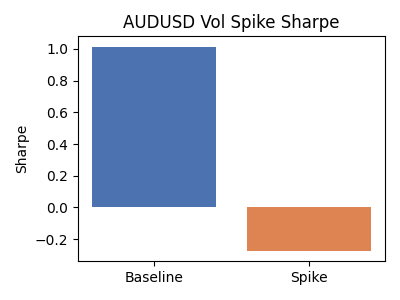 |
| GBPJPY | PASS | 20251120_145830 | -0.019 | 0.791 | 6 |  | 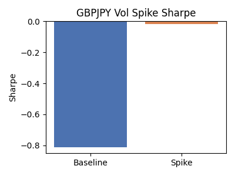 |
| USDJPY | PASS | 20251120_150051 | 1.488 | 0.327 | 156 |  | 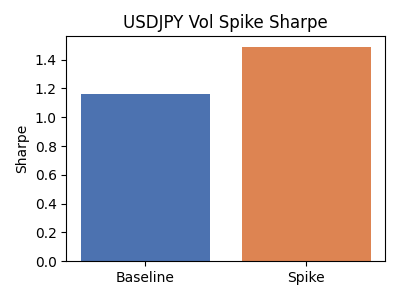 |

## Label Shuffle
| Symbol | Status | Run ID | Sharpe | ΔSharpe | AnnRet | ΔAnnRet | MaxDD | ΔMaxDD | Trades | ΔTrades | Chart |
| --- | --- | --- | --- | --- | --- | --- | --- | --- | --- | --- |
| GBPUSD | PASS | 20251120_141409 | 0.047 | -0.612 | 0.09% | -1.71% | -4.86% | 5.30% | 130 | -214 | 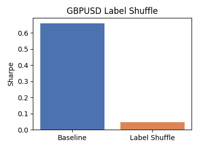 |
| EURUSD | FAIL | 20251120_144934 | -0.203 | -0.573 | -0.27% | -1.06% | -4.20% | 6.00% | 98 | -642 | 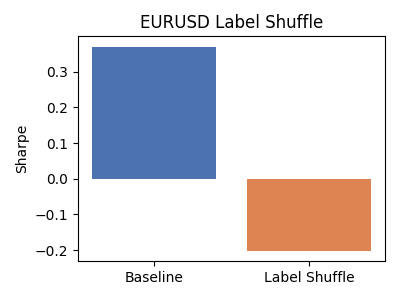 |
| USDCHF | FAIL | 20251120_145124 | 0.000 | -0.102 | 0.00% | -0.22% | 0.00% | 6.87% | 0 | -272 | 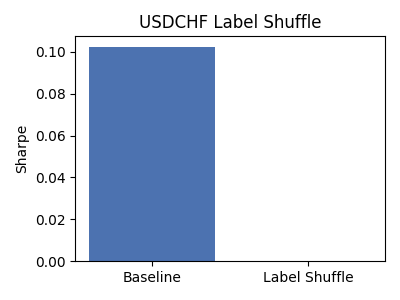 |
| AUDUSD | FAIL | 20251120_145202 | -0.473 | -1.488 | -0.70% | -2.82% | -5.70% | 4.41% | 160 | -646 | 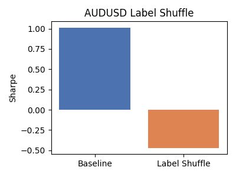 |
| GBPJPY | PASS | 20251120_145621 | 0.245 | 1.056 | 0.90% | 3.57% | -9.96% | 3.57% | 4 | -2 | 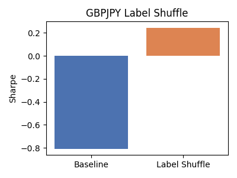 |
| USDJPY | FAIL | 20251120_145846 | -0.166 | -1.327 | -0.00% | -0.64% | -0.06% | 0.77% | 40 | -1620 | 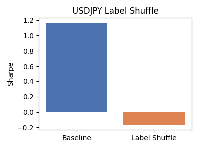 |

## Label Noise
| Symbol | Status | Run ID | Sharpe | ΔSharpe | AnnRet | ΔAnnRet | MaxDD | ΔMaxDD | Trades | ΔTrades | Chart |
| --- | --- | --- | --- | --- | --- | --- | --- | --- | --- | --- |
| GBPUSD | FAIL | 20251120_141420 | -0.593 | -1.251 | -0.47% | -2.27% | -2.59% | 7.57% | 90 | -254 | 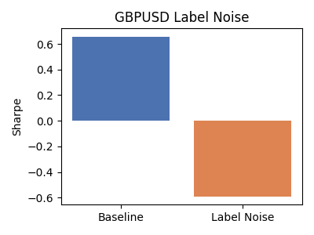 |
| EURUSD | PASS | 20251120_144943 | 0.091 | -0.279 | 0.06% | -0.73% | -1.75% | 8.45% | 78 | -662 | 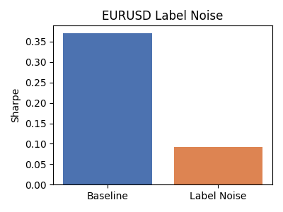 |
| AUDUSD | FAIL | 20251120_145211 | -0.777 | -1.792 | -0.36% | -2.47% | -2.05% | 8.06% | 68 | -738 | 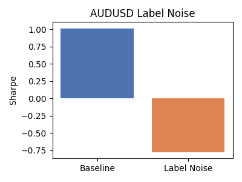 |
| GBPJPY | FAIL | 20251120_145632 | -0.201 | 0.609 | -1.14% | 1.53% | -10.07% | 3.46% | 18 | +12 | 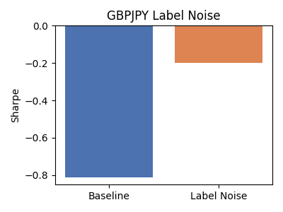 |
| USDJPY | FAIL | 20251120_145857 | -0.980 | -2.142 | -0.02% | -0.65% | -0.08% | 0.75% | 12 | -1648 | 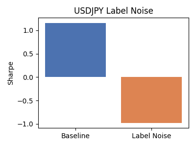 |

## Block Shuffle
| Symbol | Status | Run ID | Sharpe | ΔSharpe | AnnRet | ΔAnnRet | MaxDD | ΔMaxDD | Trades | ΔTrades | Chart |
| --- | --- | --- | --- | --- | --- | --- | --- | --- | --- | --- |
| GBPUSD | FAIL | 20251120_141430 | -0.434 | -1.092 | -1.49% | -3.28% | -8.37% | 1.79% | 652 | +308 | 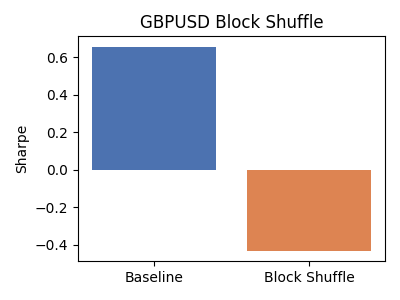 |
| EURUSD | FAIL | 20251120_144952 | -0.067 | -0.438 | -0.12% | -0.92% | -6.96% | 3.25% | 460 | -280 | 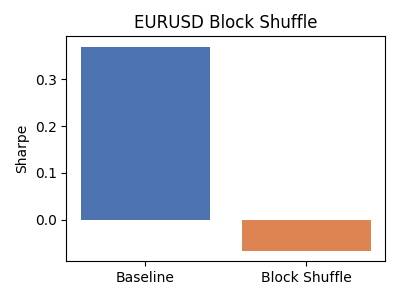 |
| AUDUSD | PASS | 20251120_145220 | 0.282 | -0.733 | 0.68% | -1.44% | -4.17% | 5.94% | 760 | -46 | 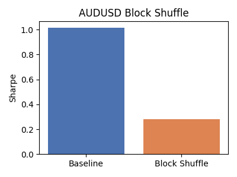 |
| GBPJPY | FAIL | 20251120_145643 | -0.039 | 0.771 | -0.17% | 2.50% | -11.24% | 2.30% | 6 | +0 | 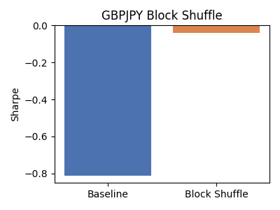 |
| USDJPY | PASS | 20251120_145907 | 1.225 | 0.064 | 0.08% | -0.55% | -0.09% | 0.74% | 170 | -1490 | 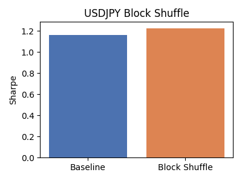 |

## Regime Dropout
| Symbol | Status | Run ID | Sharpe | ΔSharpe | AnnRet | ΔAnnRet | MaxDD | ΔMaxDD | Trades | ΔTrades | Chart |
| --- | --- | --- | --- | --- | --- | --- | --- | --- | --- | --- |
| GBPUSD | PASS | 20251120_141439 | 0.029 | -0.629 | 0.14% | -1.66% | -9.16% | 1.00% | 1504 | +1160 | 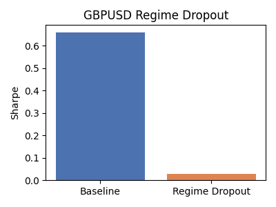 |
| EURUSD | FAIL | 20251120_145001 | -0.635 | -1.005 | -1.25% | -2.04% | -10.04% | 0.16% | 424 | -316 | 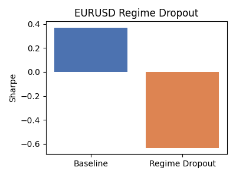 |
| AUDUSD | FAIL | 20251120_145228 | -0.275 | -1.290 | -0.95% | -3.07% | -9.50% | 0.60% | 1640 | +834 | 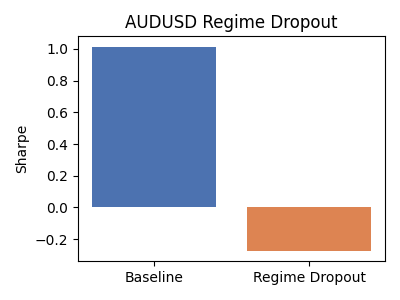 |
| GBPJPY | FAIL | 20251120_145655 | -0.019 | 0.791 | -0.10% | 2.57% | -12.30% | 1.24% | 6 | +0 | 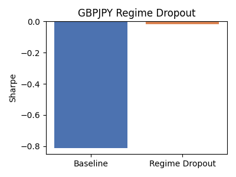 |
| USDJPY | PASS | 20251120_145917 | 1.488 | 0.327 | 0.10% | -0.53% | -0.11% | 0.73% | 156 | -1504 | 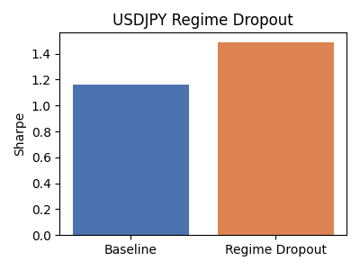 |

## Feature Ablation vol_24
| Symbol | Status | Run ID | Sharpe | ΔSharpe | AnnRet | ΔAnnRet | MaxDD | ΔMaxDD | Trades | ΔTrades | Chart |
| --- | --- | --- | --- | --- | --- | --- | --- | --- | --- | --- |
| GBPUSD | FAIL | 20251120_141448 | -0.321 | -0.979 | -0.97% | -2.76% | -10.37% | -0.21% | 602 | +258 | 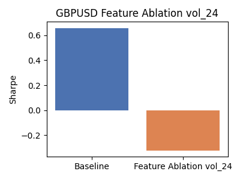 |
| EURUSD | FAIL | 20251120_145009 | -0.678 | -1.048 | -1.59% | -2.38% | -10.04% | 0.17% | 566 | -174 | 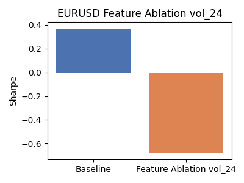 |
| AUDUSD | FAIL | 20251120_145237 | -0.882 | -1.897 | -1.99% | -4.11% | -10.01% | 0.09% | 684 | -122 | 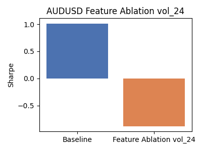 |
| GBPJPY | FAIL | 20251120_145705 | -0.023 | 0.788 | -0.11% | 2.56% | -12.24% | 1.29% | 6 | +0 | 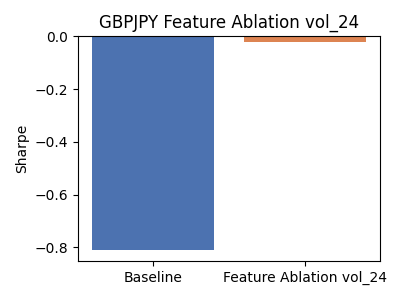 |
| USDJPY | PASS | 20251120_145928 | 1.803 | 0.642 | 0.12% | -0.51% | -0.16% | 0.67% | 198 | -1462 | 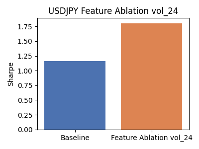 |

## Feature Ablation sma_diff
| Symbol | Status | Run ID | Sharpe | ΔSharpe | AnnRet | ΔAnnRet | MaxDD | ΔMaxDD | Trades | ΔTrades | Chart |
| --- | --- | --- | --- | --- | --- | --- | --- | --- | --- | --- |
| GBPUSD | FAIL | 20251120_141457 | -0.678 | -1.336 | -1.78% | -3.57% | -10.13% | 0.02% | 400 | +56 | 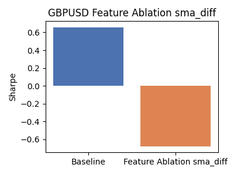 |
| EURUSD | FAIL | 20251120_145017 | -0.857 | -1.227 | -1.68% | -2.47% | -10.14% | 0.06% | 388 | -352 |  |
| AUDUSD | FAIL | 20251120_145245 | -0.597 | -1.612 | -1.63% | -3.74% | -10.17% | -0.06% | 1186 | +380 |  |
| GBPJPY | FAIL | 20251120_145716 | -0.111 | 0.699 | -0.66% | 2.01% | -11.91% | 1.63% | 10 | +4 |  |
| USDJPY | PASS | 20251120_145938 | 0.805 | -0.357 | 0.07% | -0.57% | -0.11% | 0.72% | 206 | -1454 |  |

## Feature Ablation vol_24+sma_diff
| Symbol | Status | Run ID | Sharpe | ΔSharpe | AnnRet | ΔAnnRet | MaxDD | ΔMaxDD | Trades | ΔTrades | Chart |
| --- | --- | --- | --- | --- | --- | --- | --- | --- | --- | --- |
| GBPUSD | PASS | 20251120_141505 | 0.171 | -0.488 | 0.70% | -1.09% | -7.29% | 2.87% | 1256 | +912 |  |
| EURUSD | FAIL | 20251120_145025 | -1.105 | -1.475 | -1.73% | -2.52% | -10.12% | 0.08% | 336 | -404 |  |
| AUDUSD | FAIL | 20251120_145253 | -0.818 | -1.833 | -1.81% | -3.93% | -10.04% | 0.07% | 886 | +80 |  |
| GBPJPY | PASS | 20251120_145727 | 0.216 | 1.026 | 0.90% | 3.57% | -5.68% | 7.86% | 4 | -2 |  |
| USDJPY | PASS | 20251120_145948 | 0.623 | -0.538 | 0.02% | -0.61% | -0.05% | 0.79% | 84 | -1576 |  |

## Feature Dropout
| Symbol | Status | Run ID | Sharpe | ΔSharpe | AnnRet | ΔAnnRet | MaxDD | ΔMaxDD | Trades | ΔTrades | Chart |
| --- | --- | --- | --- | --- | --- | --- | --- | --- | --- | --- |
| GBPUSD | PASS | 20251120_141514 | 0.409 | -0.249 | 1.84% | 0.05% | -7.22% | 2.94% | 1428 | +1084 |  |
| EURUSD | FAIL | 20251120_145034 | -0.172 | -0.543 | -0.64% | -1.43% | -8.34% | 1.86% | 1358 | +618 |  |
| AUDUSD | FAIL | 20251120_145302 | -0.513 | -1.528 | -1.60% | -3.72% | -10.06% | 0.05% | 1372 | +566 |  |
| GBPJPY | PASS | 20251120_145737 | 0.418 | 1.228 | 3.79% | 6.46% | -11.78% | 1.76% | 18 | +12 |  |
| USDJPY | PASS | 20251120_145958 | 1.496 | 0.335 | 0.07% | -0.57% | -0.05% | 0.79% | 108 | -1552 |  |

## Drop Sample
| Symbol | Status | Run ID | Sharpe | ΔSharpe | AnnRet | ΔAnnRet | MaxDD | ΔMaxDD | Trades | ΔTrades | Chart |
| --- | --- | --- | --- | --- | --- | --- | --- | --- | --- | --- |
| GBPUSD | FAIL | 20251120_141523 | -0.548 | -1.206 | -1.61% | -3.40% | -10.11% | 0.05% | 496 | +152 |  |
| EURUSD | FAIL | 20251120_145042 | -0.887 | -1.257 | -1.98% | -2.77% | -10.19% | 0.02% | 484 | -256 |  |
| AUDUSD | FAIL | 20251120_145310 | -0.706 | -1.721 | -1.47% | -3.58% | -9.95% | 0.16% | 574 | -232 |  |
| GBPJPY | PASS | 20251120_145748 | 0.444 | 1.254 | 3.21% | 5.88% | -12.55% | 0.99% | 12 | +6 |  |
| USDJPY | PASS | 20251120_150008 | 1.782 | 0.621 | 0.15% | -0.48% | -0.11% | 0.72% | 244 | -1416 |  |

## Vol Warp Window
| Symbol | Status | Run ID | Sharpe | ΔSharpe | AnnRet | ΔAnnRet | MaxDD | ΔMaxDD | Trades | ΔTrades | Chart |
| --- | --- | --- | --- | --- | --- | --- | --- | --- | --- | --- |
| GBPUSD | PASS | 20251120_141545 | 0.029 | -0.629 | 0.14% | -1.66% | -9.16% | 1.00% | 1504 | +1160 |  |
| EURUSD | FAIL | 20251120_145059 | -0.635 | -1.005 | -1.25% | -2.04% | -10.04% | 0.16% | 424 | -316 |  |
| AUDUSD | FAIL | 20251120_145327 | -0.275 | -1.290 | -0.95% | -3.07% | -9.50% | 0.60% | 1640 | +834 |  |
| GBPJPY | FAIL | 20251120_145809 | -0.019 | 0.791 | -0.10% | 2.57% | -12.30% | 1.24% | 6 | +0 |  |
| USDJPY | PASS | 20251120_150029 | 1.488 | 0.327 | 0.10% | -0.53% | -0.11% | 0.73% | 156 | -1504 |  |
